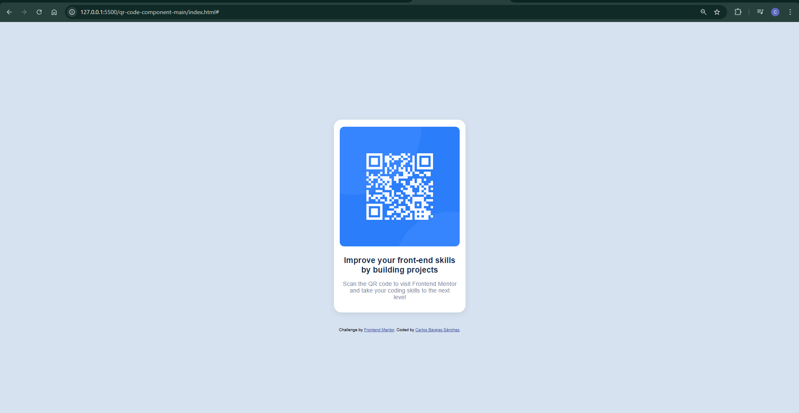

# Frontend Mentor - Solución: Componente de código QR

Esta es mi solución al reto [QR code component challenge en Frontend Mentor](https://www.frontendmentor.io/challenges/qr-code-component-iux_sIO_H). Los retos de Frontend Mentor me ayudan a mejorar mis habilidades de desarrollo construyendo proyectos reales.

## Tabla de contenidos
- [Vista general](#vista-general)
  - [Captura de pantalla](#captura-de-pantalla)
  - [Enlaces](#enlaces)
- [Mi proceso](#mi-proceso)
  - [Construido con](#construido-con)
  - [Lo que aprendí](#lo-que-aprendí)
  - [Desarrollo futuro](#desarrollo-futuro)
  - [Recursos útiles](#recursos-útiles)
- [Autor](#autor)

## Vista general

### Captura de pantalla

### Enlaces
- URL de la solución: [Agrega aquí la URL de tu repositorio]
- Sitio en vivo: [Agrega aquí la URL de tu despliegue]

## Mi proceso

### Construido con
- HTML5 semántico
- CSS personalizado
- Flexbox
- Flujo mobile-first

### Lo que aprendí
Durante este reto reforcé mis conocimientos en maquetación responsiva y el uso de Flexbox para centrar elementos. También practiqué el uso de variables de color y fuentes siguiendo una guía de estilos.

### Desarrollo futuro
Me gustaría seguir mejorando en la creación de componentes reutilizables y en la optimización de estilos para diferentes dispositivos.

### Recursos útiles
- [Guía oficial de Flexbox](https://css-tricks.com/snippets/css/a-guide-to-flexbox/) - Para repasar conceptos de alineación y distribución.
- [Documentación de Frontend Mentor](https://www.frontendmentor.io/resources) - Recursos y tips para los retos.

## Autor
- Nombre: [Carlos Barajas Sánchez]
- Frontend Mentor: [@tuusuario](https://www.frontendmentor.io/profile/CarlosBarajas75)

## Agradecimientos
Gracias a la comunidad de Frontend Mentor por el feedback y los recursos compartidos.
